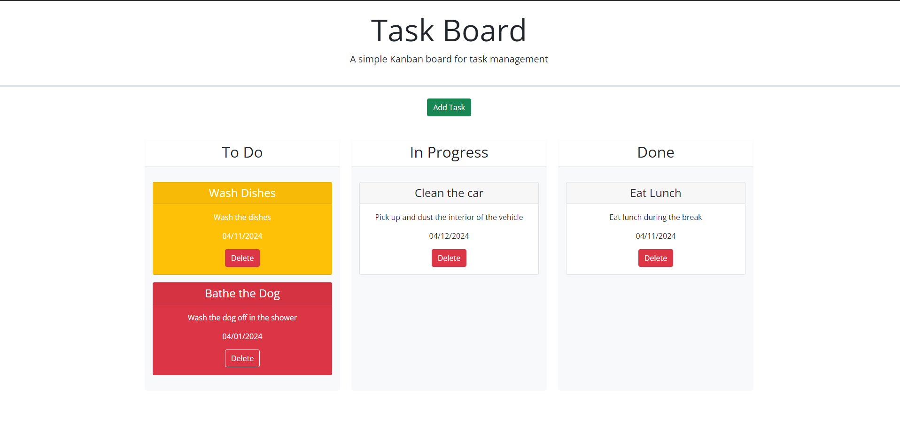

# Task Board
This is a homework assignment where I had some starter code and I needed to update it with some functions to make it work and display a task list that persists through termination of the webpage.

## Description
This is a Todo-list where the user inputs the title, date, and description of a task and the task card created will show up as red for overdue tasks, yellow for tasks due today, and white if the task is due in the future. You can drag the tasks from lane to lane as needed and whenever any task is in the 'done' lane, it will lose it's background color.

[Here is the link](https://tywalter.github.io/task-board/) to the deployed website.

## Visuals 
*  of the deployed website

## Usage
This is intended for adding tasks to a taskboard that can be removed at will and also moved around at will. This is also for grading purposes.

## Support
If you have any issues with this repo, shoot me an email at walterty89@gmail.com.